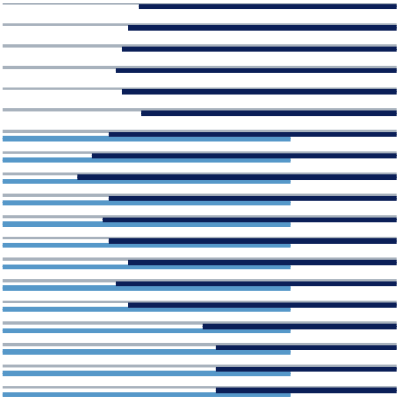

# About

<figure style="width: 20%" class="align-right"></figure> 
Our lab is part of [IDSIA](http://idsia.ch) (Dalle Molle Institute for Artificial Intelligence), affiliated with both [USI](http://usi.ch) (Università della Svizzera Italiana) and [SUPSI-DTI](http://www.supsi.ch/dti/) (Scuola Universitaria Professionale della Svizzera Italiana, Dipartimento di Tecnologie Innovative).

The lab is jointly led by IDSIA Director [Prof. Luca M. Gambardella](http://www.idsia.ch/~luca) and senior researcher [Dr. Alessandro Giusti](http://www.idsia.ch/~giusti); it is active in basic and applied research in autonomous mobile robotics, in close collaboration with other IDSIA researchers, namely the [Imprecise Probability Group](http://ipg.idsia.ch/) led by [Prof. Marco Zaffalon](http://people.idsia.ch/~zaffalon/) and the deep learning group led by [Prof. Jürgen Schmidhuber](http://people.idsia.ch/~juergen/).

We are part of the [National Centre of Competence in Research](https://nccr-robotics.ch) Robotics: a Swiss nationwide organization funded by the [Swiss National Science Foundation](http://www.snf.ch/en/Pages/default.aspx) pulling together top researchers from all over the country with the objective of developing new, human oriented robotic technology for improving our quality of life. In this context, we routinely collaborate with other Swiss robotics labs at [ETH Zurich](http://www.ethz.ch/), [EPFL](http://epfl.ch/) and the [University of Zurich](http://www.uzh.ch/index.html).

# Research

We work with both flying and ground mobile robots; our current research focuses on the following themes.






# News

## Mar 14 2019

Research on [pointing gestures for proximity interaction](http://people.idsia.ch/~gromov/pointing-gestures/) by our PhD student [Boris Gromov](http://people.idsia.ch/~gromov) got a best demonstration award **and** an honorable mention for the best video award at HRI 2019! Congratulations!

## Jan 26 2019

Check out our recent paper, accepted to the IEEE Robotics and Automation Letters with ICRA 2019 presentation: Mirko Nava, Jérôme Guzzi, R. Omar Chavez-Garcia, Luca M. Gambardella and Alessandro Giusti: Learning Long-range Perception using Self-Supervision from Short-Range Sensors and Odometry [more info](https://github.com/idsia-robotics/learning-long-range-perception){: .btn .btn--info .btn-sm}

We have three other papers accepted at ICRA 2019:
* Jérôme Guzzi, R. Omar Chavez-Garcia, Luca Maria Gambardella, and Alessandro Giusti: On the Impact of Uncertainty for Path Planning
* Boris Gromov, Gabriele Abbate, Luca Gambardella, and Alessandro Giusti: Proximity Human-Robot Interaction Using Pointing Gestures and a Wrist-mounted IMU [more info](http://people.idsia.ch/~gromov/motion-relloc/){: .btn .btn--info .btn-sm}
* Dario Mantegazza, Jérôme Guzzi, Luca Maria Gambardella, and Alessandro Giusti: Vision-based Control of a Quadrotor in User Proximity: Mediated vs End-to-End Learning Approaches [more info](https://github.com/idsia-robotics/proximity-quadrotor-learning){: .btn .btn--info .btn-sm}

## Dec 22 2018

Two videos and one demo accepted at HRI 2019!

## Oct 27 2018

Two demos accepted at AAAI 2019:
* Simone Mellace, Jerome Guzzi, Alessandro Giusti and Luca Maria Gambardella: Realtime Generation of Audible Textures Inspired by a Video Stream [more info](https://github.com/idsia-robotics/audible-textures-from-video){: .btn .btn--info .btn-sm}
* Mirko Nava, Jérôme Guzzi, Ricardo Omar Chavez-Garcia, Luca Maria Gambardella and Alessandro Giusti: Learning to perceive long-range obstacles using self-supervision from short-range sensors [more info](https://github.com/idsia-robotics/learning-long-range-perception){: .btn .btn--info .btn-sm}

## Oct 8-9 2018

Our intuitive gesture-based human-drone interaction techniques were demonstrated live during [HUBWeek](https://www.swissnexboston.org/hubweek/) in Boston. [Press coverage from the Boston Globe](https://www.bostonglobe.com/business/2018/10/09/hubweek-attendees-seek-business-opportunities-and-vision-what-come/LMN7P1vkCpNFcTzwJRaivK/story.html).  [Related papers and videos](http://people.idsia.ch/~gromov/hri-landing/){: .btn .btn--info .btn-sm}

<blockquote class="instagram-media" data-instgrm-captioned data-instgrm-permalink="https://www.instagram.com/p/BorRKLeFzTO/?utm_source=ig_embed&amp;utm_medium=loading" data-instgrm-version="12" style=" background:#FFF; border:0; border-radius:3px; box-shadow:0 0 1px 0 rgba(0,0,0,0.5),0 1px 10px 0 rgba(0,0,0,0.15); margin: 1px; max-width:540px; min-width:326px; padding:0; width:99.375%; width:-webkit-calc(100% - 2px); width:calc(100% - 2px);">
 <a href="https://www.instagram.com/p/BorRKLeFzTO/?utm_source=ig_embed&amp;utm_medium=loading" style=" background:#FFFFFF; line-height:0; padding:0 0; text-align:center; text-decoration:none; width:100%;" target="_blank"> 
 

 
 

 

<svg width="50px" height="50px" viewBox="0 0 60 60" version="1.1" xmlns="https://www.w3.org/2000/svg" xmlns:xlink="https://www.w3.org/1999/xlink"><g stroke="none" stroke-width="1" fill="none" fill-rule="evenodd"><g transform="translate(-511.000000, -20.000000)" fill="#000000"><g><path d="M556.869,30.41 C554.814,30.41 553.148,32.076 553.148,34.131 C553.148,36.186 554.814,37.852 556.869,37.852 C558.924,37.852 560.59,36.186 560.59,34.131 C560.59,32.076 558.924,30.41 556.869,30.41 M541,60.657 C535.114,60.657 530.342,55.887 530.342,50 C530.342,44.114 535.114,39.342 541,39.342 C546.887,39.342 551.658,44.114 551.658,50 C551.658,55.887 546.887,60.657 541,60.657 M541,33.886 C532.1,33.886 524.886,41.1 524.886,50 C524.886,58.899 532.1,66.113 541,66.113 C549.9,66.113 557.115,58.899 557.115,50 C557.115,41.1 549.9,33.886 541,33.886 M565.378,62.101 C565.244,65.022 564.756,66.606 564.346,67.663 C563.803,69.06 563.154,70.057 562.106,71.106 C561.058,72.155 560.06,72.803 558.662,73.347 C557.607,73.757 556.021,74.244 553.102,74.378 C549.944,74.521 548.997,74.552 541,74.552 C533.003,74.552 532.056,74.521 528.898,74.378 C525.979,74.244 524.393,73.757 523.338,73.347 C521.94,72.803 520.942,72.155 519.894,71.106 C518.846,70.057 518.197,69.06 517.654,67.663 C517.244,66.606 516.755,65.022 516.623,62.101 C516.479,58.943 516.448,57.996 516.448,50 C516.448,42.003 516.479,41.056 516.623,37.899 C516.755,34.978 517.244,33.391 517.654,32.338 C518.197,30.938 518.846,29.942 519.894,28.894 C520.942,27.846 521.94,27.196 523.338,26.654 C524.393,26.244 525.979,25.756 528.898,25.623 C532.057,25.479 533.004,25.448 541,25.448 C548.997,25.448 549.943,25.479 553.102,25.623 C556.021,25.756 557.607,26.244 558.662,26.654 C560.06,27.196 561.058,27.846 562.106,28.894 C563.154,29.942 563.803,30.938 564.346,32.338 C564.756,33.391 565.244,34.978 565.378,37.899 C565.522,41.056 565.552,42.003 565.552,50 C565.552,57.996 565.522,58.943 565.378,62.101 M570.82,37.631 C570.674,34.438 570.167,32.258 569.425,30.349 C568.659,28.377 567.633,26.702 565.965,25.035 C564.297,23.368 562.623,22.342 560.652,21.575 C558.743,20.834 556.562,20.326 553.369,20.18 C550.169,20.033 549.148,20 541,20 C532.853,20 531.831,20.033 528.631,20.18 C525.438,20.326 523.257,20.834 521.349,21.575 C519.376,22.342 517.703,23.368 516.035,25.035 C514.368,26.702 513.342,28.377 512.574,30.349 C511.834,32.258 511.326,34.438 511.181,37.631 C511.035,40.831 511,41.851 511,50 C511,58.147 511.035,59.17 511.181,62.369 C511.326,65.562 511.834,67.743 512.574,69.651 C513.342,71.625 514.368,73.296 516.035,74.965 C517.703,76.634 519.376,77.658 521.349,78.425 C523.257,79.167 525.438,79.673 528.631,79.82 C531.831,79.965 532.853,80.001 541,80.001 C549.148,80.001 550.169,79.965 553.369,79.82 C556.562,79.673 558.743,79.167 560.652,78.425 C562.623,77.658 564.297,76.634 565.965,74.965 C567.633,73.296 568.659,71.625 569.425,69.651 C570.167,67.743 570.674,65.562 570.82,62.369 C570.966,59.17 571,58.147 571,50 C571,41.851 570.966,40.831 570.82,37.631"></path></g></g></g></svg>

 
 View this post on Instagram

 

 

 

 

 

 

 

 

 

</a> 
 <a href="https://www.instagram.com/p/BorRKLeFzTO/?utm_source=ig_embed&amp;utm_medium=loading" style=" color:#000; font-family:Arial,sans-serif; font-size:14px; font-style:normal; font-weight:normal; line-height:17px; text-decoration:none; word-wrap:break-word;" target="_blank">With its leading innovation and technology Switzerland has become the new #HomeOfDrones and you can be a part of it! Join us at @hubweek and check out Swiss drones #SwissTouch</a>
 
A post shared by <a href="https://www.instagram.com/swissembassyusa/?utm_source=ig_embed&amp;utm_medium=loading" style=" color:#c9c8cd; font-family:Arial,sans-serif; font-size:14px; font-style:normal; font-weight:normal; line-height:17px;" target="_blank"> Swiss Embassy in the USA</a> (@swissembassyusa) on <time style=" font-family:Arial,sans-serif; font-size:14px; line-height:17px;" datetime="2018-10-08T14:51:38+00:00">Oct 8, 2018 at 7:51am PDT</time>

</blockquote> 

<blockquote class="twitter-tweet" data-lang="en">
A drone that can be controlled with the mere movement of an arm? <a href="https://twitter.com/IDSIARobotics?ref_src=twsrc%5Etfw">@IDSIARobotics</a> makes the fantasy come true...<a href="https://twitter.com/hashtag/HWOpenDoors?src=hash&amp;ref_src=twsrc%5Etfw">#HWOpenDoors</a> <a href="https://twitter.com/hashtag/SwissTouch?src=hash&amp;ref_src=twsrc%5Etfw">#SwissTouch</a> <a href="https://twitter.com/hashtag/DroneFrontier?src=hash&amp;ref_src=twsrc%5Etfw">#DroneFrontier</a> <a href="https://twitter.com/hashtag/Swiss4Tech?src=hash&amp;ref_src=twsrc%5Etfw">#Swiss4Tech</a> <a href="https://t.co/yNK7hlkmiX">pic.twitter.com/yNK7hlkmiX</a>
&mdash; swissnex Boston (@swissnexBoston) <a href="https://twitter.com/swissnexBoston/status/1049367880830259206?ref_src=twsrc%5Etfw">October 8, 2018</a></blockquote>

## Oct 1 2018
We received an [Optimus Agora' Award](http://www.snf.ch/en/researchinFocus/newsroom/Pages/news-180920-robots-in-the-classroom.aspx) from the [Swiss National Science Foundation](http://www.snf.ch/en/Pages/default.aspx) for the project *Introducing People to Research in Robotics through an Extended Peer Community in Southern Switzerland*, a joint effort by the Educational Robotics group at SUPSI and the Laboratoire de Systèmes Robotiques at EPFL.

<figure style="width: 30%" class="align-right"></figure>
## Jul 27 2018
Our research was featured in the Neue Zürcher Zeitung, one of the most prestigious daily swiss newspapers.

## Jul 18 2018
Congratulations to our MSc students Mirko Nava and Dario Mangegazza, who successfully defened their thesis. 

## Jun 29 2018
Our paper "*Robot Identification and Localization with Pointing Gestures*" was accepted at IROS 2018.  [Details](http://people.idsia.ch/~gromov/motion-relloc/){: .btn .btn--info .btn-sm}


## Jun 27 2018
Congratulations to Jerome Guzzi, who successfully defended his PhD thesis at USI.

<figure style="width: 30%" class="align-right"></figure>
## Jus 21 2018
RSI, the italian-speaking swiss public broadcasting corporation, [covered](https://www.rsi.ch/news/oltre-la-news/Svizzera-Eldorado-dei-droni-10598922.html) our drone research and filmed their journalists interacting with our robots.

## Mar 24 2018
Our paper "*A model of artificial emotions for behavior modulation and implicit coordination in multi-robot systems*" was accepted at GECCO 2018 in the Swarm Intelligence Track (acceptance rate 22%). [Details](https://github.com/jeguzzi/artificial-emotions){: .btn .btn--info .btn-sm}

<figure style="width: 30%" class="align-right"></figure>
## Mar 15 2018
Congratulations to our BSc Students Stefano Toniolo and Denis Broggini. Stefano won the [Swissengineering](http://www.swissengineering-ti.ch/) [Talent Ticino Prize](http://www.fondazionepremio.ch/premiati/#2018) for his work on [self-supervised learning for obstacle detection](https://www.aaai.org/ocs/index.php/AAAI/AAAI18/paper/view/16374).  Denis won the best presentation award for his work on ML for poinging gesture detection using wearable IMUs (also published as a [student abstract](https://www.aaai.org/ocs/index.php/AAAI/AAAI18/paper/viewPaper/16259) at AAAI 2018).

## Feb 5 2018
Our self-supervised learning techniques demonstrated to the public during the AAAI 2018 demo session ([link](https://www.aaai.org/ocs/index.php/AAAI/AAAI18/paper/view/16374))

## Jan 26 2018
CNN journalists from [Connect the World](https://edition.cnn.com/shows/connect-the-world) filmed our robots in action.

## Jan 15 2018
Our paper on *Learning Ground Traversability from Simulations* accepted for the IEEE Robotics and Automation Letters ([arxiv](https://arxiv.org/abs/1709.05368))

## Dec 23 2017
Our video "landing a drone with pointing gestures" was accepted at HRI 2018.  [Details](http://people.idsia.ch/~gromov/hri-landing/){: .btn .btn--info}


## Dec 12 2017
With several other NCCR Robotics laboratories we have been collaborating on an integrative demo project targeted at rescue missions.  The resulting video, which was recorded during the live demo held in Lausanne in Nov 2017, features some of our research about [human-robot interaction](http://people.idsia.ch/~gromov/hri-landing/) and machine learning for [traversability estimation](https://arxiv.org/abs/1709.05368).


# Work with us

[Contact us](mailto:alessandrog@idsia.ch) if you are interested in a position in our lab as a Research Engineer, PhD student, or Post-doc researcher.

# Sponsors

- [Swiss National Science Foundation](http://www.snf.ch/en/Pages/default.aspx)
- [National Centre of Competence in Research (NCCR) Robotics](https://nccr-robotics.ch)
- [Innosuisse](https://www.innosuisse.ch/inno/de/home.html)
- The [Eurostars-Eureka](https://www.eurostars-eureka.eu/) programme of the EU
- [NVidia](https://developer.nvidia.com/academic_gpu_seeding) GPU Grants
