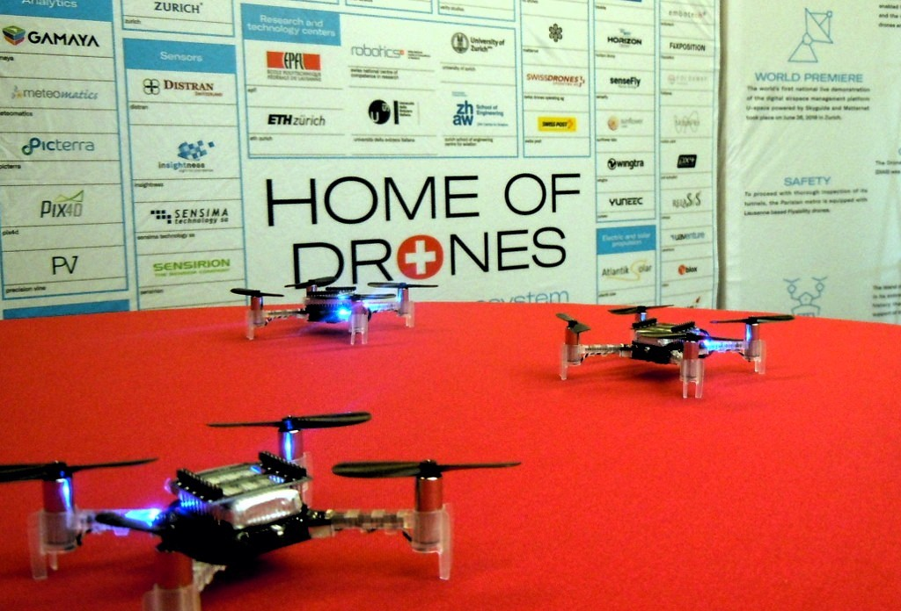

# About

<figure style="width: 20%" class="align-right"></figure> 
Our lab is part of [IDSIA](http://idsia.ch) (Dalle Molle Institute for Artificial Intelligence), affiliated with both [USI](http://usi.ch) (Università della Svizzera Italiana) and [SUPSI-DTI](http://www.supsi.ch/dti/) (Scuola Universitaria Professionale della Svizzera Italiana, Dipartimento di Tecnologie Innovative).

We are active in basic and applied research in autonomous mobile robotics, in close collaboration with other IDSIA researchers, namely the [Imprecise Probability Group](http://ipg.idsia.ch/) led by [Prof. Marco Zaffalon](http://people.idsia.ch/~zaffalon/) and the deep learning group led by [Prof. Jürgen Schmidhuber](http://people.idsia.ch/~juergen/).

We are part of the [National Centre of Competence in Research](https://nccr-robotics.ch) Robotics: a Swiss nationwide organization funded by the [Swiss National Science Foundation](http://www.snf.ch/en/Pages/default.aspx) pulling together top researchers from all over the country with the objective of developing new, human oriented robotic technology for improving our quality of life. In this context, we routinely collaborate with other Swiss robotics labs at [ETH Zurich](http://www.ethz.ch/), [EPFL](http://epfl.ch/) and the [University of Zurich](http://www.uzh.ch/index.html).

# Research

We work with both flying and ground mobile robots; our current research focuses on the following themes.







# News

<figure style="width: 30%" class="align-right"></figure> 
## Oct 8-9 2018
Our intuitive gesture-based human-drone interaction techniques were demonstrated live during [HUBWeek](https://www.swissnexboston.org/hubweek/) in Boston. [Related papers and videos](http://people.idsia.ch/~gromov/hri-landing/){: .btn .btn--info}

## Oct 1 2018
We received an [Optimus Agora' Award](http://www.snf.ch/en/researchinFocus/newsroom/Pages/news-180920-robots-in-the-classroom.aspx) from the [Swiss National Science Foundation](http://www.snf.ch/en/Pages/default.aspx) for the project *Introducing People to Research in Robotics through an Extended Peer Community in Southern Switzerland*, a joint effort by the Educational Robotics group at SUPSI and the Laboratoire de Systèmes Robotiques at EPFL.

<figure style="width: 30%" class="align-right"></figure>
## Jul 27 2018
Our research was featured in the Neue Zürcher Zeitung, one of the most prestigious daily swiss newspapers.

## Jul 18 2018
Congratulations to our MSc students Mirko Nava and Dario Mangegazza, who successfully defened their thesis. 

## Jun 29 2018
Our paper "*Robot Identification and Localization with Pointing Gestures*" was accepted at IROS 2018.  [Details](http://people.idsia.ch/~gromov/motion-relloc/){: .btn .btn--info}


## Jun 27 2018
Congratulations to Jerome Guzzi, who successfully defended his PhD thesis at USI.

<figure style="width: 30%" class="align-right"></figure>
## Jus 21 2018
RSI, the italian-speaking swiss public broadcasting corporation, [covered](https://www.rsi.ch/news/oltre-la-news/Svizzera-Eldorado-dei-droni-10598922.html) our drone research and filmed their journalists interacting with our robots.

## Mar 24 2018
Our paper "*A model of artificial emotions for behavior modulation and implicit coordination in multi-robot systems*" was accepted at GECCO 2018 in the Swarm Intelligence Track (acceptance rate 22%). [Details](https://github.com/jeguzzi/artificial-emotions){: .btn .btn--info}

<figure style="width: 30%" class="align-right"></figure>
## Mar 15 2018
Congratulations to our BSc Students Stefano Toniolo and Denis Broggini. Stefano won the [Swissengineering](http://www.swissengineering-ti.ch/) [Talent Ticino Prize](http://www.fondazionepremio.ch/premiati/#2018) for his work on [self-supervised learning for obstacle detection](https://www.aaai.org/ocs/index.php/AAAI/AAAI18/paper/view/16374).  Denis won the best presentation award for his work on ML for poinging gesture detection using wearable IMUs (also published as a [student abstract](https://www.aaai.org/ocs/index.php/AAAI/AAAI18/paper/viewPaper/16259) at AAAI 2018).

## Feb 5 2018
Our self-supervised learning techniques demonstrated to the public during the AAAI 2018 demo session ([link](https://www.aaai.org/ocs/index.php/AAAI/AAAI18/paper/view/16374))

## Jan 26 2018
CNN journalists from [Connect the World](https://edition.cnn.com/shows/connect-the-world) filmed our robots in action.

## Jan 15 2018
Our paper on *Learning Ground Traversability from Simulations* accepted for the IEEE Robotics and Automation Letters ([arxiv](https://arxiv.org/abs/1709.05368))

## Dec 23 2017
Our video "landing a drone with pointing gestures" was accepted at HRI 2018.  [Details](http://people.idsia.ch/~gromov/hri-landing/){: .btn .btn--info}


# People

## Staff

 - [Prof. Luca Gambardella](http://people.idsia.ch/~luca)
 - [Dr. Alessandro Giusti](http://people.idsia.ch/~giusti)
 - [Dr. Omar Chavez](http://romarcg.xyz)
 - [Dr. Jerome Guzzi](https://github.com/jeguzzi)
 - [Boris Gromov](http://people.idsia.ch/~gromov)
 - Prof. Alberto Piatti (with SUPSI-DFA)
 - Dr. Lucio Negrini (with SUPSI-DFA)

## Current students and interns

 - Mirko Nava
 - Dario Mantegazza
 - Gabriele Abbate
 - Sonny Monti

## Past members

 - Prof. [Gianni di Caro](http://www.giannidicaro.com/) (now at [Carnegie Mellon University - Quatar](https://www.qatar.cmu.edu/))
 - Dr. Eduardo Feo Flushing (now at [Carnegie Mellon University - Quatar](https://www.qatar.cmu.edu/))
 - Dr. Jawad Nagi (now at [UBS](https://www.ubs.com))
 - Dr. Frederick Ducatelle (now at [Nuance](https://www.nuance.com/index.html))

# Work with us

We have one open PhD position. [Details](http://www.supsi.ch/home/dms/supsi/docs/supsi/offerte-lavoro/2018/180921_551_PhDstudent_in_Machine_Learning_of_Control_Task_ENG.pdf){: .btn .btn--info}

# Sponsors

- [Swiss National Science Foundation](http://www.snf.ch/en/Pages/default.aspx)
- [National Centre of Competence in Research (NCCR) Robotics](https://nccr-robotics.ch)
- [Innosuisse](https://www.innosuisse.ch/inno/de/home.html)
- The [Eurostars-Eureka](https://www.eurostars-eureka.eu/) programme of the EU
- [NVidia](https://developer.nvidia.com/academic_gpu_seeding) GPU Grants
